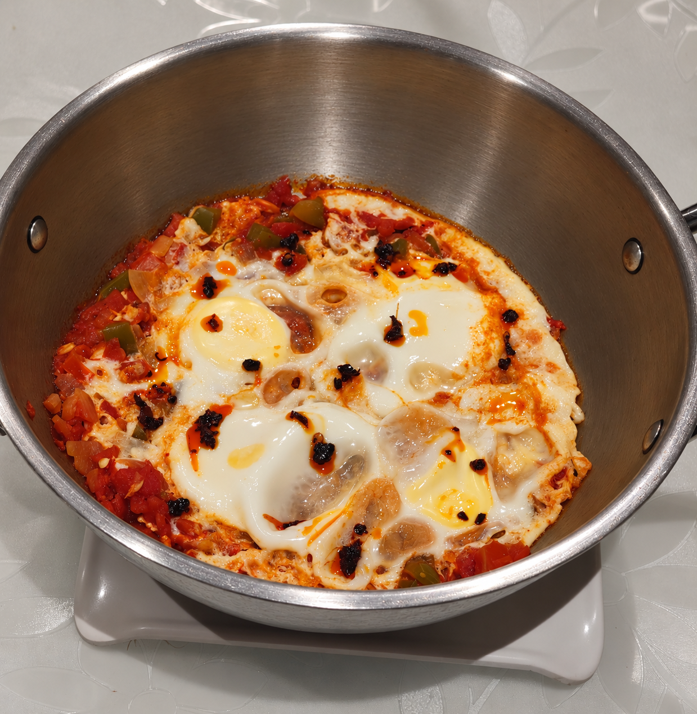

# Shakshuka - 8.2/10
Perfect for breakfast but may take some time to make  
Serving Size: 1 serving

## Nutrition

- Calories: \~350 kcal
- Protein: \~22 g
- Carbohydrates: \~22 g
- Fat: \~19 g

## Ingredients

- 3 eggs
- 2 medium tomatoes, chopped into small dices or crushed  (can reduce the fresh chopped tomotoes and use some purée for a deeper sauce)
- 1/2 medium onion, finely chopped
- 1/2 capsicum, chopped (red one looks better)
- 2–3 garlic cloves, finely chopped
- 1 tsp olive oil
- 1/2 tsp cumin powder
- 1/2 tsp paprika / Kashmiri chilli powder
- 1/4 tsp red chilli powder
- 1/4 tsp black pepper
- Salt to taste
- Fresh coriander, chopped
- Chilli flakes, optional

### To serve
- 1–2 slices toasted bread or 1 roti, optional
- Fresh coriander

## Steps

1. Heat 1 tsp olive oil in a pan over medium heat.
2. Add the chopped onion and capsicum and cook for 4–5 minutes until they begin to soften. The onions will start looking a little translucent.
3. Add the chopped garlic and cook for another 30–60 seconds. Cooking for too long might burn the garlic
4. Add cumin powder, paprika/Kashmiri chilli powder, red chilli powder, black pepper, and salt. Stir for around 30 seconds.
5. Add the chopped/crushed tomatoes and mix everything together.
6. Let the tomato mixture simmer uncovered for 8–10 minutes until it thickens into a sauce. The tomatoes should have a jammy consistency.
7. Taste the sauce and adjust the salt and spices if required. Add a lil bit of sugar if the tomatoes are too acidic.
8. Make three small wells in the tomato mixture and crack one egg into each well.
9. Cover the pan and cook on low-medium heat for around 4–6 minutes, until the egg whites are cooked but the yolks are still slightly runny. Cook longer if you prefer firm yolks.
10. Finish with fresh coriander, black pepper, and chilli oil or flakes.
11. Serve hot with toasted bread or a roti if you want a more filling meal.

## Notes
- This recipe makes 1 serving.
- Let the tomato sauce thicken properly before adding the eggs. It should not be too watery.
- Keeping the yolks slightly runny makes the shakshuka creamier when mixed with the tomato sauce.
- You can add 2 extra egg whites for around 7 g additional protein with only around 35 extra calories.
- Adding bread or roti will increase the calories and carbohydrates.
- You can add a small amount of feta or paneer on top for extra flavour and protein, although this will increase the calories.
- The vegetables and spices can easily be adjusted depending on what you have available.

## Source
Adapted from traditional North African and Middle Eastern shakshuka recipes. But if you do need a source for this: https://youtu.be/VNW2_ndBWYg?si=i30P-YfrydaY1zPM
although this video is a little indianized and honestly it can be made any way you want.